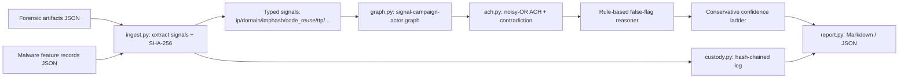

# DRAGNET

**Evidence-to-actor attribution with auditable ACH, false-flag hypotheses and chain of custody.**

DRAGNET takes incident evidence (forensic host artifacts plus static malware *feature records*) and produces a
confidence-graded attribution assessment. The output includes an Analysis of Competing Hypotheses (ACH)
matrix, the evidence-to-campaign links behind it, false-flag indicators, a list of what evidence would raise or
lower confidence, and a hash-chained custody log. The design goal is to avoid overclaiming. When evidence is thin
or contradictory, DRAGNET says so and does not name an actor.

> This is an MVP. All data is **synthetic**: IOCs use reserved ranges (RFC 5737 IPs, `.example` domains,
> fabricated hashes), and actor labels such as `LAZARUS_SIM` are simulation stand-ins inspired by public reporting.
> They are not real intelligence.

## Architecture



| Module | Role |
|---|---|
| `models.py` | Typed signals, evidence, campaigns, assessments; per-kind weights; forgeable vs. hard signal classes |
| `ingest.py` | Forensic and malware-feature JSON to deduplicated signals, with a content hash per item |
| `custody.py` | Canonical SHA-256 and a tamper-evident, hash-chained custody log (`verify()`) |
| `graph.py` | Bipartite index linking signals to campaigns to actors, plus evidence-to-campaign edges |
| `ach.py` | Hypothesis scoring (each actor plus the mandatory `FALSE_FLAG` and `UNKNOWN`), ACH matrix, false-flag rules, confidence grading |
| `report.py` / `cli.py` | Markdown and JSON reports; `assess` and `demo` commands |

**Scoring.** Each actor's support is the noisy-OR of the weights of the signals that match it. Its contradiction
is the noisy-OR of the weights of signals that link to *other* actors. The score is `support * (1 - 0.6 * contradiction)`.
Weights are per signal kind, are printed in every report, and can be overridden with `--weight kind=value`.
Forgeable kinds (Rich header, language artifacts, mutexes) can never support an attribution on their own.
Reaching HIGH requires at least two independent hard signal kinds, a clear margin over the runner-up, and no
false-flag indicators.

## Quickstart

```bash
python -m pip install -r requirements.txt    # runtime itself is stdlib-only
make test                                    # or: python -m pytest -q
make demo                                    # or: python -m dragnet demo
python -m dragnet assess fixtures/cases/wannacry_like.json --format json
python -m dragnet assess fixtures/cases/multi_signal_boost.json --weight imphash=0 --weight ip=0
```

Demo output:

```
case                          leading       confidence    flags
multi_signal_boost            SANDWORM_SIM  HIGH          0
olympic_destroyer_like        -             INSUFFICIENT  2
thin_evidence                 -             INSUFFICIENT  0
wannacry_like                 LAZARUS_SIM   HIGH          0
```

These cases cover the five scenarios in the spec. Scenario 4, flipping a weight, is exercised with `--weight`
and in the tests.

## Prior art and how DRAGNET differs

| Existing | What it does | DRAGNET difference |
|---|---|---|
| MISP correlation | IOC-to-IOC matching | Ingests forensic and malware evidence, then reasons over competing hypotheses instead of reporting raw matches |
| Malpedia / Intezer code genetics | Single-signal code-similarity attribution | Code reuse is one weighted signal among infra, TTPs, victimology and others; single signals are capped |
| Manual analyst ACH | Structured but hand-built and not reproducible | Deterministic, weight-transparent, custody-hashed and re-runnable |

The contribution is the combination, not any single matcher: signals from several sources are fused into one ACH
assessment that always includes false-flag and unknown hypotheses.

## Ethics of attribution

Attribution is an analytic judgment, and getting it wrong has real consequences, both diplomatic and legal, and
for the people named. DRAGNET is built as decision support. It shows its reasoning, prefers "insufficient" to a
guess, treats easily planted artifacts as suspect, and every report tells the reader to have a qualified analyst
review it. Do not use the tool's output as a sole basis for public naming, retaliation or any "hack-back" activity.

## Roadmap / TODO (out of MVP scope)

- [ ] **Grade C/D:** seed the campaign graph from curated public APT reports (MITRE ATT&CK groups, vendor reports), with provenance per edge.
- [ ] **Grade D:** ground-truth validation on the published WannaCry, NotPetya, Olympic Destroyer and Lazarus case studies; Brier calibration; false-flag resistance rate.
- [ ] **Grade D:** real sample handling only inside the SPECIMEN offline lab; integration with VITRINE (static features) and REVENANT (artifact extraction).
- [ ] TTP-embedding similarity and imphash/fuzzy-hash clustering in place of exact matching.
- [ ] OCCAM graph backend (Neo4j or similar) instead of the in-memory index.
- [ ] Signed custody log (e.g. Ed25519) and export to a case-management format (STIX 2.1 report).
- [ ] Research experiment: multi-signal ACH vs. single-signal baselines.

See [THREAT_MODEL.md](THREAT_MODEL.md) and [SECURITY.md](SECURITY.md).
