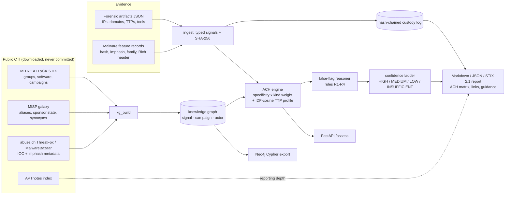

# DRAGNET

[](https://github.com/rakshit-737/dragnet/actions/workflows/ci.yml)

[](https://rakshit-737.github.io/dragnet/)
[](LICENSE)


**Evidence-to-actor attribution that says "I don't know" when it should.** DRAGNET fuses forensic
artifacts, malware feature records, infrastructure and ATT&CK techniques into an auditable Analysis of
Competing Hypotheses (ACH) with mandatory false-flag and unknown hypotheses, a conservative confidence
ladder and a hash-chained custody log - evaluated on real public threat intelligence (MITRE ATT&CK,
MISP galaxy, abuse.ch, APTnotes) and on documented cases including the Olympic Destroyer false flag.

**Contribution in one sentence.** DRAGNET attributes from artifact-level evidence - host IOCs, malware
genetics from published imphash/TLSH metadata, infrastructure and ATT&CK techniques - fused with
specificity weighting and forgeability-aware false-flag rules into an ACH that abstains rather than
misattributes, and it is evaluated leakage-controlled and time-split on public data.

> Headline (leakage-controlled, per-report ATT&CK cases, n = 637, 161 groups): DRAGNET ranks the true
> group first in **45%** [40, 51] vs 30-31% for IOC-correlation and code-only matchers and 2-22% for
> TTP-similarity baselines; when it commits at MEDIUM it is right **95%** of the time (79/83). On the
> 25 ATT&CK campaigns with the campaign's own reports removed from the profiles, top-1 is **0.40**
> (0.68 without that control - read 0.68 as a leaky upper bound) and its edge over IOC correlation
> there is **not** significant (p = 0.25). With a stolen exclusive decoy family planted, the
> false-flag rules cut confident decoy attributions from 0.40 to 0.17 (effect 0.23 [0.11, 0.37]).


## Try it in 60 seconds

No install needed - the runtime is stdlib-only:

```bash
git clone --depth 1 https://github.com/rakshit-737/dragnet && cd dragnet
python -m dragnet demo
python -m dragnet assess dragnet/data/cases/olympic_destroyer_like.json
```

`demo` prints one row per synthetic scenario (four cases: a confident multi-signal attribution, a
Rich-header false flag that is withheld with 2 flags, a WannaCry-like code-reuse case, and thin
evidence that abstains). The fifth spec scenario, auditability, is `assess dragnet/data/cases/wannacry_like.json
--weight imphash=0.2`: every weight is printed in the report, and the overridden weight and the
resulting scores show up in the ACH matrix (here the verdict stays LAZARUS_SIM, HIGH, because two
independent anchors remain).

**Docs site:** <https://rakshit-737.github.io/dragnet/> (architecture, benchmarks, CLI/API reference, demo reports).

## Contents

[Try it](#try-it-in-60-seconds) · [How it works](#how-it-works) · [Results](#results-on-real-data) · [Case studies](#documented-case-studies) ·
[Datasets](#datasets) · [Quickstart](#quickstart) · [Reproduce](#reproducing-the-numbers) ·
[Prior art](#prior-art-and-how-dragnet-differs) · [Limitations](#limitations) · [Roadmap](#roadmap) · [Safety](#safety-and-ethics)

## How it works



**Scoring.** For each actor, support is a noisy-OR over (a) the case's point signals that link to it,
each weighted `kind weight x specificity` where specificity = 1 / number of actors the signal links to
(an exclusive family counts fully, Mimikatz, linked to 51 groups in ATT&CK v19.2, counts 1/51), and (b) one tradecraft term
`0.6 x IDF-cosine(case techniques, actor technique profile)`. Contradiction is the noisy-OR of signals
that link to other actors; `score = support x (1 - 0.6 x contradiction)`. Every weight is printed in
the report and can be overridden (`--weight imphash=0.2`). See [ADR 0002](docs/adr/0002-specificity-and-ttp-similarity.md).

**False-flag reasoning is rule-based on purpose** ([ADR 0003](docs/adr/0003-false-flag-rules.md)):

| Rule | Fires when |
|---|---|
| R1 | an actor is supported only by discriminating forgeable artifacts (Rich header, language, mutex) |
| R2 | forgeable artifacts and hard evidence point to disjoint actors (the Olympic Destroyer pattern) |
| R3 | specific hard evidence points to actors of *different* sponsor states (same-state overlap becomes a note) |
| R4 | anchored tooling/infrastructure points to one actor while tradecraft clearly matches another state's actor (the Turla-OilRig pattern) |

**Confidence ladder.** HIGH needs two independent anchor kinds, score >= 0.85, margin >= 0.3 and no
flags; MEDIUM needs an anchor, score >= 0.6, margin >= 0.2 and no flags. Tradecraft-only evidence can
reach at most LOW. Any false-flag indicator caps the verdict at LOW, and if `FALSE_FLAG` leads, no actor
is named.

| Module | Role |
|---|---|
| `dragnet/sources/` | loaders: ATT&CK STIX, MISP galaxy, APTnotes, abuse.ch ThreatFox / MalwareBazaar (metadata) |
| `dragnet/kg_build.py` | builds the knowledge graph (profiles, campaigns, aliases, sponsor state, IOC and imphash layers) |
| `dragnet/graph.py` | signal index, specificity, IDF-cosine TTP similarity |
| `dragnet/ach.py` | ACH scoring, false-flag rules, confidence ladder, ACH matrix |
| `dragnet/ingest.py`, `custody.py` | evidence to signals, content hashing, tamper-evident custody log |
| `dragnet/cases.py` | curated real cases (time-of-incident vs retrospective knowledge) |
| `dragnet/bench.py`, `scripts/run_benchmarks.py` | baselines, ablations, metrics, false-flag stress test |
| `dragnet/report.py`, `cli.py`, `api.py`, `neo4j_export.py` | reports, CLI, optional FastAPI, Neo4j Cypher export |
| `dragnet/stix.py` | STIX 2.1 bundle export |
| `dragnet/adapters.py` | REVENANT / VITRINE JSON exports to case files |
| `dragnet/tlsh.py`, `casesets.py` | TLSH distance and banded index; enlarged case sets |

## Results on real data

All numbers come from `scripts/run_benchmarks.py`, run by the [`bench` workflow](.github/workflows/bench.yml)
on a GitHub runner; the full tables (with every CI) are in [`results/RESULTS.md`](results/RESULTS.md) and
the per-case output in `results/benchmark.json`. Protocol: [ADR 0004](docs/adr/0004-evaluation-protocol.md);
exact commands and expected values: [Reproduce](docs/reproduce.md).

**Methods.** `dragnet` (full engine); `ttp-jaccard` and `ttp-cosine` (nearest actor by technique
overlap; a generic nearest-profile baseline with no single canonical reference);
`ttp-binary-bayes` (a simplified binary-profile form of the P(technique | actor) scoring in Guru, Moss &
Kochenderfer, arXiv:2505.11547; it is *not* the paper's count-based scorer, which is evaluated separately
in the Guru comparison in RESULTS.md and reaches far higher top-1);
`ioc-correlation` (MISP-style count of shared families/tools/IOCs); `code-only` (shared family/imphash
count, a Malpedia/Intezer-style single-signal matcher).

**How commitments are counted.** A baseline commits only when one actor holds the unique top score; a
tie at the top is an abstention (the old alphabetical tie-break made `menuPass` win 26-way ties and
inflated the baselines' error rate). DRAGNET commits at MEDIUM or HIGH. Both "wrong at MEDIUM+ /
committed" and "wrong actor named at any grade" (which counts DRAGNET's LOW verdicts) are reported, so
the comparison is like for like. Proportions carry exact Clopper-Pearson intervals; paired top-1
differences use an exact sign-flip test with Holm correction.

### R - per-report ATT&CK cases, leave-report-out (n = 637 over 161 groups; headline)

Each case is the techniques and software that one cited report documents for one group. In the
k-fold protocol, the fold's reports are removed from every profile first; in the temporal protocol,
profiles use only reports dated before 2022 and the 193 cases dated 2022+ are attributed.

| method | top-1 (k-fold) | coverage | selective acc. | wrong at any grade | top-1 (temporal) |
|---|---|---|---|---|---|
| dragnet | **0.454** [0.401, 0.507] | 0.429 | **0.853** | 0.063 | **0.207** |
| code-only | 0.310 | 0.323 | 0.913 | 0.028 | 0.124 |
| ioc-correlation | 0.301 | 0.349 | 0.788 | 0.074 | 0.112 |
| ttp-cosine | 0.218 | 0.983 | 0.222 | 0.765 | 0.083 |
| ttp-jaccard | 0.126 | 0.936 | 0.133 | 0.812 | 0.052 |
| ttp-binary-bayes | 0.018 | 0.702 | 0.022 | 0.686 | 0.008 |

DRAGNET's top-1 lead over every baseline is significant in both protocols (Holm p < 0.001). Per
grade (k-fold): MEDIUM 79/83 correct (0.95), LOW 154/190 (0.81). Under the temporal split the
picture is weaker: LOW is right only 20/44 times (0.45), while MEDIUM stays 8/8. Code-only has the
higher selective accuracy (0.913 vs 0.853) at lower coverage; at equal coverage DRAGNET's selective
risk is lower (risk at 20% coverage 0.031 vs 0.048; area under the risk-coverage curve 0.247 vs 0.353).

**Signal-family ablation (same engine).** TTP-only DRAGNET reaches 0.218 top-1 at 9.6% coverage,
software-only 0.358; fusing both gives 0.454 (+0.095 over software-only, p < 0.001). TTP-only DRAGNET
ranks exactly like `ttp-cosine` (same IDF-cosine term), so it adds no separate evidence; the fusion gain
is the gain over software-only.


 Replacing the
IDF-cosine TTP term with per-technique noisy-OR (`no-ttpsim`) is *better* on top-1 here (0.487 vs
0.454, k-fold), so the TTP-profile term is not justified by this data; it is kept as the default only
because it is not worse on the temporal split (0.221 vs 0.207, p = 0.78) and this is reported, not tuned away.

**Calibration.** The raw ACH score is *not* calibrated (temporal ECE 0.145 [0.099, 0.203]). An
isotonic map fitted on 357 pre-2022 cases brings ECE on the 193 later cases to 0.051 [0.033, 0.118];
the TTP baselines' normalised shares are already at 0.03-0.06, so "calibrated" is not a DRAGNET
advantage. Use the discrete grade, or the isotonic map.

### A1-LF / A1 - the 25 ATT&CK v19.2 campaigns (176 candidate groups)

In 18 of 25 campaigns the true group's v19.2 profile already lists the campaign's own software, and all
14 of DRAGNET's correct named verdicts in plain A1 are among them. A1-LF removes, before each campaign,
every group edge whose citations are a subset of the campaign's own citations.

| method | top-1 A1-LF | coverage | selective acc. | wrong at any grade | top-1 A1 (leaky) |
|---|---|---|---|---|---|
| dragnet | **0.400** [0.20, 0.60] | 0.40 | 0.80 | 0.08 | 0.680 [0.48, 0.84] |
| ioc-correlation | 0.354 | 0.32 | **1.00** | **0.00** | 0.560 |
| code-only | 0.341 | 0.36 | 0.89 | 0.04 | 0.540 |
| ttp-jaccard | 0.120 | 0.96 | 0.13 | 0.84 | 0.120 |
| ttp-cosine | 0.080 | 0.96 | 0.08 | 0.88 | 0.080 |

At n = 25 DRAGNET's advantage over ioc-correlation (+0.046 [-0.03, 0.15]) and code-only (+0.059)
is **not significant** (exact sign-flip p = 0.25, Holm 1.0); in leaky A1 it was +0.12 / +0.14 with
p = 0.06 (Holm 0.31), so the earlier "P = 0.01" claim from a percentile bootstrap is withdrawn. With
ties treated as abstentions, ioc-correlation makes no wrong commitments; DRAGNET's 0/25 wrong at
MEDIUM+ bounds its rate below 0.137 (exact 95%), not at zero.


### A2 / B2 - older profiles and rolling origin

ATT&CK v10.1 has no campaign objects, so A2 (v19.2 campaigns against v10.1 profiles) measures stale,
open-world profiles rather than a temporal hold-out: DRAGNET top-1 0.41 vs ioc-correlation 0.41 and
code-only 0.36, abstaining on 75% of cases whose group did not exist in v10.1. Restricted to the 12
campaigns whose activity began after v10.1 (A2-later), every method is near the floor (DRAGNET 0.14).
B2 attributes each campaign against the newest release published before it was added (12.1-18.1):
DRAGNET 0.47, ioc-correlation 0.35, code-only 0.32 (n = 25).

### A3 - a new family from its documented techniques only (n = 411)

Top-1 is 0.063 for DRAGNET and ttp-cosine, 0.029 for ttp-jaccard. DRAGNET names an actor in 2.4% of
cases, and **all 10 of those LOW verdicts are wrong** (0/10, 95% CI [0, 0.31]): technique overlap alone
does not attribute, and a LOW verdict from tradecraft only should be read as "no attribution".

### G - comparison with published work: Guru, Moss & Kochenderfer (2025)

Guru et al. rank 29 actors per threat report with P(technique | actor) estimated from technique counts
in training reports (machine-extracted with text-embeddings over 727 reports) and report the mean rank
of the true actor (random = 15). Their corpus and extracted counts are not public in reusable form, so
this is an **adaptation, not a reproduction**: same scorer, same 29 actors, same 70/20/10 per-actor
splits and 10 repetitions, but ATT&CK's human-curated per-report technique lists (261 reports).

| setting | mean rank of the true actor (of 29) |
|---|---|
| paper: uniform prior | 10.68 +/- 0.53 |
| paper: expert prior | 7.75 +/- 0.09 |
| paper: HyDE + expert prior (best) | 7.55 +/- 0.21 |
| ours: their scorer, uniform prior, human technique lists | 8.72 +/- 0.55 |
| ours: their scorer, report-share prior (expert-prior proxy) | 9.71 +/- 0.45 |
| **ours: DRAGNET** (techniques + software, same splits) | **5.38 +/- 0.79** (top-1 0.53) |

Their scorer on cleaner human technique lists lands between their uniform-prior and expert-prior
results; DRAGNET's lower rank comes mostly from the software evidence their setup does not use. The
fuzzy-hash study of Kida & Olukoya (IEEE Access 2023, 89% on APTMalware) cannot be matched: it needs
the binaries, and only 12 of its 3,719 SHA-256s appear in MalwareBazaar metadata.

### D - false-flag stress test (A1 cases with planted decoy artifacts, decoy from another sponsor state)

| method | L1: Rich header + language planted | L2: + stolen exclusive decoy family (10-seed mean, range) |
|---|---|---|
| **dragnet** | 0.00 confidently names decoy | **0.17** (0.12-0.24) |
| dragnet without false-flag rules | 0.00 | 0.40 (0.40-0.40) |
| ioc-correlation | 0.48 | 0.77 (0.76-0.80) |
| code-only | 0.00 | 0.40 (0.40-0.40) |

Level 1 does not test the rules: forgeable artifacts cannot reach MEDIUM on their own, so DRAGNET
without the rules (and code-only) also score 0.00, and R1 fires by construction because the planted
Rich header matches exactly one simulated reference. Level 2 isolates the rules: they reduce
confident decoy attributions by 0.23 [0.11, 0.37] (bootstrap clustered by case, all case x seed
cells). Only cross-state decoys are tested. False-alarm cost: indicators fire on 16% of clean
campaigns (grade capped at LOW).


### E - genetics and IOCs from abuse.ch metadata (time split at 2024-01-01)

- **E2 imphash (MalwareBazaar).** 13,402 test samples share only 1,139 imphashes and are 63% AgentTesla,
  so per-sample accuracy mostly measures re-identification of a few commodity families. With the
  training-period collision filter, DRAGNET covers 7.8% at 0.918 selective accuracy (family-clustered
  95% CI [0.46, 1.00]; macro over 25 families 0.92). A plain imphash lookup with the same filter gets
  0.998 at 6.4% - the filter, not the fusion, does the work. 85% of MEDIUM+ verdicts are WannaCry;
  without WannaCry, coverage is 2.4% at 0.73.
- **E3 TLSH (MalwareBazaar, metadata only).** Pre-cutoff digests of actor-specific families become
  fuzzy signals; the radius tau = 100 was chosen (the shipped runtime default `TLSH_TAU = 50` is
  more conservative; at distance < 100 the Trend Micro TLSH paper reports about a 6.43% file-pair
  false-positive rate) on a 2023-H2 validation window. On 30,641 post-cutoff
  samples DRAGNET covers 3.9% at 0.844 [0.46, 0.96] (macro over 37 families 0.59) vs a TLSH
  nearest-neighbour lookup at 5.2% / 0.808; no TLSH-only verdict reaches MEDIUM. False alarms on
  families with no actor mapping: 0.7% named, 0% at MEDIUM+. The stdlib banded index recovers 0.969
  of true neighbour pairs against exact search.
- **B3 Malpedia-labelled abuse.ch cases** (129 families; labels from Malpedia, graph from ATT&CK v14.1 +
  pre-cutoff data). Artifacts alone (IOCs, imphash, TLSH) give 4% top-1: abuse.ch metadata for
  post-2024 activity rarely links back to what ATT&CK knew in 2023. Adding the family name lifts
  top-1 to 0.27. All methods tie on top-1 here; this case set does not separate them.
- **E1 ThreatFox.** 99.2% of IOC values occur in exactly one row of the export (re-sightings do not add
  rows), so the export cannot measure IOC longevity and no longevity claim is made.

### F - accuracy vs public reporting depth

With ATT&CK-only aliases, top-1 is 0.36 for A1 actors with no APTnotes report (n = 11), 0.89 for 1-5
reports (n = 9) and 1.00 for more (n = 5); Fisher p = 0.007. This is an association, not a cause:
APTnotes is dense for 2010-2018, so "0 reports" partly means "recently named actor".


## Documented case studies

Seven curated cases in [`dragnet/data/real_cases/`](dragnet/data/real_cases/), each with its ground-truth basis
(indictments, government attributions) and references. In **time-of-incident** mode the family first seen
in the incident (WannaCry, NotPetya, Olympic Destroyer) is hidden from the graph. Rules R2 and R4 were
designed from the Olympic Destroyer and Turla/OilRig patterns, and several cases rely on cited,
hand-written graph additions, so these are **demonstrations of designed behaviour, not validation**.

| case | truth (public attribution) | DRAGNET (time-of-incident) | false-flag indicators | ioc-correlation baseline |
|---|---|---|---|---|
| WannaCry 2017 | Lazarus Group | Lazarus Group, MEDIUM | 0 | Lazarus Group |
| NotPetya 2017 | Sandworm Team | Sandworm Team, MEDIUM | 0 | Sandworm Team |
| **Olympic Destroyer 2018** | Sandworm Team | **withheld (INSUFFICIENT)** | 3 | menuPass (wrong) |
| **Turla via OilRig 2019** | Turla | names OilRig at **LOW** with a flag (Turla ranked 2nd) | 1 | OilRig (wrong) |
| Bangladesh Bank 2016 | Lazarus / APT38 | Lazarus Group, MEDIUM | 0 | Lazarus Group |
| Sony Pictures 2014 | Lazarus Group | Lazarus Group, MEDIUM | 0 | Lazarus Group |
| Commodity tooling only | none | withheld (INSUFFICIENT) | 0 | tie among 26 (abstains) |

For Olympic Destroyer DRAGNET reports that the Lazarus-linked Rich header is the only support for
Lazarus and that forgeable and hard evidence point to different actors; it does **not** recover
Sandworm from tradecraft alone (truth ranked 12th). Run them with `python -m dragnet case-study`
(add `--format md` for full reports).

## Datasets

Metadata only - no sample is ever downloaded. Details, licences and citations: [docs/datasets.md](docs/datasets.md).

| Source | Size | Pin | Licence |
|---|---|---|---|
| MITRE ATT&CK Enterprise v19.2 + v10.1 (STIX) | 54 + 31 MB | version + SHA-256 | ATT&CK Terms of Use |
| MISP galaxy threat-actor + malpedia | 1.4 + 3.8 MB | commit `e9e867f` | CC0/BSD-2 ; CC BY-NC-SA 3.0 |
| APTnotes index | 0.15 MB | commit `8595fbd` | index metadata |
| abuse.ch ThreatFox full export | 3.8 MB | manifest SHA-256 | CC0 |
| abuse.ch MalwareBazaar full CSV (metadata, incl. TLSH) | 223 MB | manifest SHA-256 | CC0 |
| MITRE ATT&CK Enterprise 12.1-18.1, ICS + Mobile 19.2 | ~315 MB | version + SHA-256 | ATT&CK Terms of Use |
| Malpedia API families and actors | 5.4 MB | manifest SHA-256 (live API) | CC BY-NC-SA 3.0 |
| trendmicro/tlsh reference vectors (tests) | 0.25 MB | commit + SHA-256 | Apache-2.0 |

## Quickstart

```bash
git clone https://github.com/rakshit-737/dragnet && cd dragnet
python -m pip install -e ".[dev,api,sign]"     # runtime is stdlib-only; extras for API and signing
python -m pytest -q                            # ~90 tests; real-data tests are deselected by default
python -m dragnet demo                         # four synthetic scenarios
python -m dragnet assess dragnet/data/cases/olympic_destroyer_like.json
```

With real data (~600 MB):

```bash
export DRAGNET_DATA="$PWD/data/raw"            # PowerShell: $env:DRAGNET_DATA = "$PWD\data\raw"
python scripts/download_data.py                # or: DRAGNET_DATA=/path python scripts/download_data.py
python -m dragnet build-kg                     # -> $DRAGNET_DATA/kg-attack-19.2.json
python -m dragnet case-study olympic_destroyer_2018 --format md
python -m dragnet assess my_case.json --kg "$DRAGNET_DATA/kg-attack-19.2.json" --format json
python -m dragnet export-cypher --kg "$DRAGNET_DATA/kg-attack-19.2.json" -o dragnet.cypher   # Neo4j
pip install -e ".[api]" && python -m dragnet serve --kg "$DRAGNET_DATA/kg-attack-19.2.json" # POST /assess
```

Interoperability and custody:

```bash
python -m dragnet assess case.json --format stix -o bundle.json          # STIX 2.1 bundle
pip install -e ".[sign]" && python -m dragnet keygen analyst               # analyst.key / analyst.pub
python -m dragnet assess case.json --sign-key analyst.key -o report.json   # Ed25519 over the custody head
python -m dragnet verify report.json --pub analyst.pub                     # exit 1 on tampering
python -m dragnet import incident-7 --revenant rev.json --vitrine tri.json -o case.json
docker run --rm -v "$PWD:/w" ghcr.io/rakshit-737/dragnet assess /w/case.json
```

A case file is `{"case_id": ..., "evidence": [{"id", "kind": "forensic"|"malware", "content": {...}}]}`;
forensic content accepts `network_connections`, `dns_queries`, `dropped_file_hashes`, `ttps`, `tools`,
`mutexes`, `language_artifacts`, `victimology`; malware content accepts `sha256`, `imphash`, `code_reuse`,
`family`, `ttps`, `rich_header`, `language_artifacts`, `c2`, `c2_ips`, `mutexes`, `tools`.

## Reproducing the numbers

See [docs/reproduce.md](docs/reproduce.md) for every command, its runtime and the expected values.
In short:

```bash
python scripts/download_data.py                              # SHA-256 checked for pinned sources
PYTHONHASHSEED=0 python scripts/run_benchmarks.py --only A1LF,A1,G   # light sections, ~3 min
```

The full run (all sections, 1454 s on a 2-vCPU GitHub runner) is the
[`bench` workflow](https://github.com/rakshit-737/dragnet/actions/workflows/bench.yml); it compares the
deterministic sections with the committed `results/benchmark.json`. abuse.ch exports and the Malpedia
API change daily, so B3/E1/E2/E3 drift; everything else is deterministic.

## Prior art and how DRAGNET differs

| Existing | What it does | DRAGNET |
|---|---|---|
| MISP correlation | IOC-to-IOC matching | ingests forensic + malware evidence and reasons over competing hypotheses; measured as the `ioc-correlation` baseline |
| Malpedia / Intezer code genetics | single-signal code-similarity attribution | code/imphash is one specificity-weighted anchor among several; `code-only` baseline |
| TTP-similarity attribution (e.g. ATT&CK-profile nearest neighbour) | ranks actors by technique overlap | IDF-cosine profile term is one input; A3 shows why it cannot stand alone |
| OCCAM (sibling project) | report/TTP-level ACH over ATT&CK incidents with learned grades | artifact-level evidence (IOCs, imphash/TLSH genetics, infrastructure) with forgeability-aware false-flag rules |
| Manual analyst ACH | structured but hand-built, not reproducible | deterministic, weight-transparent, custody-hashed, re-runnable, with mandatory false-flag hypothesis |

## Limitations

- **Small curated n.** 25 attributed ATT&CK campaigns (26 across all releases and domains) and 7
  curated cases; per-report cases (n = 637) are the larger set, but they are slices of the same reports
  ATT&CK profiles are built from (handled by leave-report-out, not eliminated).
- **Ground truth is itself attribution.** ATT&CK, Malpedia and government statements can be wrong;
  Malpedia and ATT&CK agree on 203 of 217 families both attribute.
- **Leakage.** Plain A1 is a leaky upper bound (0.68); A1-LF (0.40) and R are the controlled numbers.
- **Genetics results are dominated by commodity families** (AgentTesla, WannaCry); family-macro and
  WannaCry-excluded numbers are reported next to per-sample ones.
- **Tradecraft-only LOW verdicts are unreliable** (A3: 0/10; R-temporal LOW 0.45).
- **The TTP-profile term is not supported by the per-report data** (no-ttpsim is better on k-fold top-1).
- **Raw scores are not calibrated**; use the grade or the isotonic map (temporal ECE 0.051).
- **Curated tokens.** Where public evidence is a relationship (a copied Rich header), curated cases use
  descriptive tokens with cited sources rather than raw artifacts.
- **Monte-Carlo p-values print as 0.000.** Where the sign-flip test falls back to Monte Carlo
  (B = 200,000 sign flips, more than 20 discordant pairs), RESULTS.md prints 0.000; read these as
  p < 1/(B+1) = 5e-6. The reporting fix lands with the next bench run.
- **Headline engine is not the best ablation on the per-report set**: no-ttpsim scores 0.487 top-1
  versus 0.454 for the full engine.
- **One test warning** (Starlette TestClient / httpx deprecation) remains.
- REVENANT / VITRINE integration is file-based; there is no live coupling.
- Signed custody proves integrity and, with a pinned public key, signer identity; key management is out of scope.

## Roadmap

- [x] Real knowledge graph from ATT&CK + MISP + abuse.ch with provenance
- [x] Leave-report-out evaluation, per-report case set (n = 637), rolling-origin release split
- [x] TLSH fuzzy genetics with a banded index and a time-split benchmark
- [x] Comparison with Guru et al. (2025) under an adapted protocol
- [x] Isotonic calibration evaluated on a temporal split
- [x] Signed custody, STIX 2.1 export, REVENANT / VITRINE adapters, Neo4j export, FastAPI
- [ ] Victimology signals from MISP (sector, country) in the signal-family ablation
- [ ] OCCAM STIX import

## Safety and ethics

DRAGNET is defensive decision support. It never downloads, stores or executes malware (abuse.ch data is
consumed as metadata only), contains no real victim data, and performs no network activity beyond the
explicit dataset download. Attribution is an analytic judgment with diplomatic, legal and human
consequences: every report says so, DRAGNET prefers "insufficient" to a guess, and its output must not
be the sole basis for public naming, sanctions or any "hack-back". See [THREAT_MODEL.md](THREAT_MODEL.md)
and [SECURITY.md](SECURITY.md).

## License

MIT - see [LICENSE](LICENSE). Dataset licences are listed in [docs/datasets.md](docs/datasets.md).
