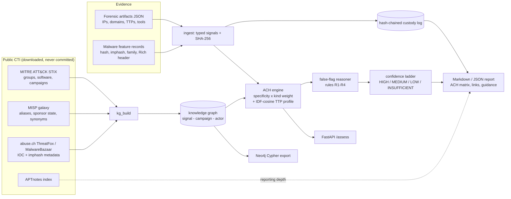

# DRAGNET

[](https://github.com/rakshit-737/dragnet/actions/workflows/ci.yml)

[](LICENSE)


**Evidence-to-actor attribution that says "I don't know" when it should.** DRAGNET fuses forensic
artifacts, malware feature records, infrastructure and ATT&CK techniques into an auditable Analysis of
Competing Hypotheses (ACH) with mandatory false-flag and unknown hypotheses, a conservative confidence
ladder and a hash-chained custody log - evaluated on real public threat intelligence (MITRE ATT&CK,
MISP galaxy, abuse.ch, APTnotes) and on documented cases including the Olympic Destroyer false flag.

> Headline (ATT&CK campaigns, n = 25): DRAGNET ranks the attributed group first in **68%** of
> campaigns and **never commits at MEDIUM+ to a wrong actor**; the MISP-style indicator-correlation
> baseline gets 56% and commits to a wrong actor in 24% of cases. With a planted Rich header and
> decoy-language strings, DRAGNET flags every case and confidently names the decoy in **0%** (baseline 52%).

## Contents

[How it works](#how-it-works) · [Results](#results-on-real-data) · [Case studies](#documented-case-studies) ·
[Datasets](#datasets) · [Quickstart](#quickstart) · [Reproduce](#reproducing-the-numbers) ·
[Prior art](#prior-art-and-how-dragnet-differs) · [Limitations](#limitations) · [Roadmap](#roadmap) · [Safety](#safety-and-ethics)

## How it works



**Scoring.** For each actor, support is a noisy-OR over (a) the case's point signals that link to it,
each weighted `kind weight x specificity` where specificity = 1 / number of actors the signal links to
(an exclusive family counts fully, Mimikatz used by ~60 groups counts 1/60), and (b) one tradecraft term
`0.6 x IDF-cosine(case techniques, actor technique profile)`. Contradiction is the noisy-OR of signals
that link to other actors; `score = support x (1 - 0.6 x contradiction)`. Every weight is printed in
the report and can be overridden (`--weight imphash=0.2`). See [ADR 0002](docs/adr/0002-specificity-and-ttp-similarity.md).

**False-flag reasoning is rule-based on purpose** ([ADR 0003](docs/adr/0003-false-flag-rules.md)):

| Rule | Fires when |
|---|---|
| R1 | an actor is supported only by discriminating forgeable artifacts (Rich header, language, mutex) |
| R2 | forgeable artifacts and hard evidence point to disjoint actors (the Olympic Destroyer pattern) |
| R3 | specific hard evidence points to actors of *different* sponsor states (same-state overlap becomes a note) |
| R4 | anchored tooling/infrastructure points to one actor while tradecraft clearly matches another state's actor (the Turla-OilRig pattern) |

**Confidence ladder.** HIGH needs two independent anchor kinds, score >= 0.85, margin >= 0.3 and no
flags; MEDIUM needs an anchor, score >= 0.6, margin >= 0.2 and no flags. Tradecraft-only evidence can
reach at most LOW. Any false-flag indicator caps the verdict at LOW, and if `FALSE_FLAG` leads, no actor
is named.

| Module | Role |
|---|---|
| `dragnet/sources/` | loaders: ATT&CK STIX, MISP galaxy, APTnotes, abuse.ch ThreatFox / MalwareBazaar (metadata) |
| `dragnet/kg_build.py` | builds the knowledge graph (profiles, campaigns, aliases, sponsor state, IOC and imphash layers) |
| `dragnet/graph.py` | signal index, specificity, IDF-cosine TTP similarity |
| `dragnet/ach.py` | ACH scoring, false-flag rules, confidence ladder, ACH matrix |
| `dragnet/ingest.py`, `custody.py` | evidence to signals, content hashing, tamper-evident custody log |
| `dragnet/cases.py` | curated real cases (time-of-incident vs retrospective knowledge) |
| `dragnet/bench.py`, `scripts/run_benchmarks.py` | baselines, ablations, metrics, false-flag stress test |
| `dragnet/report.py`, `cli.py`, `api.py`, `neo4j_export.py` | reports, CLI, optional FastAPI, Neo4j Cypher export |

## Results on real data

All numbers below come from `python scripts/run_benchmarks.py` on the snapshot in
[`data/MANIFEST.json`](data/MANIFEST.json); the full tables are in [`results/RESULTS.md`](results/RESULTS.md)
and the raw per-case output in `results/benchmark.json`. Protocol: [ADR 0004](docs/adr/0004-evaluation-protocol.md).

**Methods.** `dragnet` (full engine); `ttp-jaccard` (nearest actor by Jaccard over techniques, the common
literature baseline); `ttp-cosine` (the same IDF-cosine DRAGNET uses, alone); `ioc-correlation`
(MISP-style count of shared families/tools/IOCs); `code-only` (shared family/imphash/code count - a
Malpedia/Intezer-style single-signal matcher). Ties are scored in expectation.

### A1 - ATT&CK v19.2 campaigns attributed against group profiles (n = 25, 176 candidate groups)

| method | top-1 | top-3 | coverage | selective acc. | confident-error rate |
|---|---|---|---|---|---|
| **dragnet** | **0.68** | **0.68** | 0.60 | **0.93** | **0.00** |
| ttp-jaccard | 0.12 | 0.16 | 0.96 | 0.13 | 0.84 |
| ttp-cosine | 0.08 | 0.16 | 0.96 | 0.08 | 0.88 |
| ioc-correlation | 0.56 | 0.62 | 0.84 | 0.71 | 0.24 |
| code-only | 0.54 | 0.56 | 0.60 | 0.93 | 0.04 |

*Coverage* = share of cases where the method names an actor; *confident-error rate* = share of all cases
where it commits (MEDIUM+ for DRAGNET, always for baselines) to the wrong actor.


DRAGNET's stated grades are well ordered: **MEDIUM 5/5 correct, LOW 9/10 correct, INSUFFICIENT - the
top-ranked actor was right only 3/10 times**, i.e. it abstains exactly where evidence is weak.
Ablations: removing specificity drops top-1 to 0.60, replacing the TTP profile term with per-technique
noisy-OR drops it to 0.60; the false-flag reasoner does not cost accuracy on clean cases.

### A2 - temporal hold-out: ATT&CK v10.1 (Nov 2021) profiles vs campaigns documented later (n = 25)

8 of the 25 campaigns belong to groups that did not exist in v10.1 (open world - the right answer is to abstain).

| method | top-1 (in-KG) | selective acc. | confident-error rate | abstains when actor unknown |
|---|---|---|---|---|
| **dragnet** | **0.41** | **0.78** | **0.00** | **0.75** |
| ttp-cosine | 0.24 | 0.25 | 0.80 | 0.00 |
| ioc-correlation | 0.41 | 0.46 | 0.40 | 0.63 |
| code-only | 0.36 | 0.67 | 0.16 | 0.88 |

### A3 - "new malware family" attribution from behaviour alone (n = 411 families used by one group)

Evidence is only the family's documented ATT&CK techniques. Top-1 is **0.063 (DRAGNET, ttp-cosine)
vs 0.029 (ttp-jaccard)** among 176 groups, and DRAGNET names an actor in only 2.4% of cases - an honest
reflection that technique overlap alone cannot attribute. This is the strongest empirical argument in
this repo for multi-signal fusion.

### D - false-flag stress test (A1 cases with planted decoy artifacts, decoy from another sponsor state)

| method | L1: Rich header + language planted - confidently names decoy | L2: + stolen exclusive decoy family - confidently names decoy |
|---|---|---|
| **dragnet** | **0.00** (flagged 100%) | **0.24** (flagged 76%) |
| dragnet without false-flag rules | 0.00 | 0.40 |
| ioc-correlation | 0.52 | 0.76 |
| code-only | 0.00 | 0.40 |


The TTP-only baselines never pick the decoy - but they also rank the true actor first in only 8-12% of
cases. False-alarm cost: indicators fire on 16% of *clean* campaigns (grade capped at LOW, never a wrong name).

### E - abuse.ch metadata

- **IOC shelf-life (ThreatFox).** Of 1,395 IOCs of ATT&CK-attributed families first seen after the
  median date, only 6 (**0.4%**) were already known from the earlier half. IOC matching alone has almost
  no longevity for attribution.
- **Imphash genetics (MalwareBazaar, 493,634 labelled samples; train < 2024-01-01, test after; 13,379
  test samples of ATT&CK-attributed families).** A naive imphash lookup covers 83% of test samples but
  is right only **13%** of the time (shared packer/.NET stub imphashes). With DRAGNET's collision filter
  (drop imphashes seen in > 2 families *in the training period*) plus specificity, coverage falls to
  7.7% and accuracy rises to **91.7%**; the 6.3% of samples DRAGNET grades MEDIUM or higher are
  **99.8%** correct - genetics is a precise but rare anchor.

### F - does accuracy track public reporting depth?

Grouping A1 cases by how many APTnotes reports mention the true actor: top-1 is 0.40 for actors with
no indexed reports (n = 10) and 0.85 for actors with more than five (n = 13). Attribution quality is
bounded by how well-documented the actor already is.

**Calibration.** DRAGNET's ACH score for its top actor is conservative: in A1 the Brier score of the
binary forecast "top actor is correct" is 0.16 with ECE 0.28, driven by *under*-confidence (all 8 cases scored
0.5-0.7 were correct; n is small, so the curve is noisy); the stated grades, not the raw score, are the
output to rely on.


## Documented case studies

Seven curated cases in [`fixtures/real_cases/`](fixtures/real_cases/), each with its ground-truth basis
(indictments, government attributions) and references. In **time-of-incident** mode the family first seen
in the incident (WannaCry, NotPetya, Olympic Destroyer) is hidden from the graph, so DRAGNET must
attribute from pre-existing knowledge.

| case | truth (public attribution) | DRAGNET (time-of-incident) | false-flag indicators | ioc-correlation baseline |
|---|---|---|---|---|
| WannaCry 2017 | Lazarus Group | Lazarus Group, MEDIUM | 0 | Lazarus Group |
| NotPetya 2017 | Sandworm Team | Sandworm Team, HIGH | 0 | Sandworm Team |
| **Olympic Destroyer 2018** | Sandworm Team | **withheld (INSUFFICIENT)** | 3 | menuPass (wrong) |
| **Turla via OilRig 2019** | Turla | OilRig, **LOW** + flag (Turla ranked 2nd) | 1 | OilRig (wrong) |
| Bangladesh Bank 2016 | Lazarus / APT38 | Lazarus Group, MEDIUM | 0 | Lazarus Group |
| Sony Pictures 2014 | Lazarus Group | Lazarus Group, MEDIUM | 0 | Lazarus Group |
| Commodity tooling only | none | withheld (INSUFFICIENT) | 0 | menuPass (wrong) |

All seven behave as specified (attribute / withhold with a flag / abstain). For Olympic Destroyer DRAGNET
reports that the Lazarus-linked Rich header is the only support for Lazarus and that forgeable and hard
evidence point to different actors; it does **not** recover Sandworm from tradecraft alone (truth
ranked 12th), which is the honest limit of the available evidence. Run them with
`python -m dragnet case-study` (add `--format md` for full reports).

## Datasets

Metadata only - no sample is ever downloaded. Details, licences and citations: [docs/datasets.md](docs/datasets.md).

| Source | Size | Pin | Licence |
|---|---|---|---|
| MITRE ATT&CK Enterprise v19.2 + v10.1 (STIX) | 54 + 31 MB | version + SHA-256 | ATT&CK Terms of Use |
| MISP galaxy threat-actor + malpedia | 1.4 + 3.8 MB | commit `e9e867f` | CC0/BSD-2 ; CC BY-NC-SA 3.0 |
| APTnotes index | 0.15 MB | commit `8595fbd` | index metadata |
| abuse.ch ThreatFox full export | 3.8 MB | manifest SHA-256 | CC0 |
| abuse.ch MalwareBazaar full CSV (metadata) | 223 MB | manifest SHA-256 | CC0 |

## Quickstart

```bash
git clone https://github.com/rakshit-737/dragnet && cd dragnet
python -m pip install -e ".[dev]"              # runtime is stdlib-only
python -m pytest -q                            # 53 tests; real-data tests skip without downloads
python -m dragnet demo                         # five synthetic spec scenarios
python -m dragnet assess fixtures/cases/olympic_destroyer_like.json
```

With real data (~320 MB):

```bash
python scripts/download_data.py                # or: DRAGNET_DATA=/path python scripts/download_data.py
python -m dragnet build-kg                     # -> $DRAGNET_DATA/kg-attack-19.2.json
python -m dragnet case-study olympic_destroyer_2018 --format md
python -m dragnet assess my_case.json --kg "$DRAGNET_DATA/kg-attack-19.2.json" --format json
python -m dragnet export-cypher --kg "$DRAGNET_DATA/kg-attack-19.2.json" -o dragnet.cypher   # Neo4j
pip install -e ".[api]" && python -m dragnet serve --kg "$DRAGNET_DATA/kg-attack-19.2.json" # POST /assess
```

A case file is `{"case_id": ..., "evidence": [{"id", "kind": "forensic"|"malware", "content": {...}}]}`;
forensic content accepts `network_connections`, `dns_queries`, `dropped_file_hashes`, `ttps`, `tools`,
`mutexes`, `language_artifacts`, `victimology`; malware content accepts `sha256`, `imphash`, `code_reuse`,
`family`, `ttps`, `rich_header`, `language_artifacts`, `c2`, `c2_ips`, `mutexes`, `tools`.

## Reproducing the numbers

```bash
python scripts/download_data.py        # checksums verified for pinned sources
python scripts/run_benchmarks.py       # ~5 min; writes results/ and docs/figures/
```

`make` targets mirror these (`make data`, `make bench`, `make demo`, `make test`). abuse.ch exports are
regenerated daily, so E1/E2 will drift slightly from the committed snapshot; everything else is
deterministic (seeded decoy selection, tie-aware metrics). The committed `data/MANIFEST.json` is only
rewritten by `download_data.py --record`, so a fresh download does not silently replace the recorded snapshot.

## Prior art and how DRAGNET differs

| Existing | What it does | DRAGNET |
|---|---|---|
| MISP correlation | IOC-to-IOC matching | ingests forensic + malware evidence and reasons over competing hypotheses; measured as the `ioc-correlation` baseline |
| Malpedia / Intezer code genetics | single-signal code-similarity attribution | code/imphash is one specificity-weighted anchor among several; `code-only` baseline |
| TTP-similarity attribution (e.g. ATT&CK-profile nearest neighbour) | ranks actors by technique overlap | IDF-cosine profile term is one input; A3 shows why it cannot stand alone |
| Manual analyst ACH | structured but hand-built, not reproducible | deterministic, weight-transparent, custody-hashed, re-runnable, with mandatory false-flag hypothesis |

## Limitations

- **Small n.** 25 attributed ATT&CK campaigns and 7 curated cases; differences of one case move top-1 by 4 points.
- **Ground truth is itself attribution.** ATT&CK and government statements can be wrong or incomplete.
- **Residual leakage.** Group profiles in v19.2 were partly written from the same reporting as the
  campaigns; A2 (temporal) and the time-of-incident mode reduce but do not eliminate this.
- **Curated tokens.** Where public evidence is a relationship (a copied Rich header, a shared function),
  the curated cases use descriptive tokens with cited sources rather than raw artifacts.
- **Coarse sponsor-state and language signals** (MISP country), and ATT&CK "actor-specific" families
  include some commodity malware ATT&CK attributes to a few groups (e.g. AgentTesla).
- **Raw scores are under-confident**; use the grade. No HIGH verdicts occur on ATT&CK-only evidence
  (it has no infrastructure signals).
- Stage-5 extras from the spec (signed custody, STIX 2.1 report export, live REVENANT/VITRINE integration)
  are not implemented.

## Roadmap

- [x] Real knowledge graph from ATT&CK + MISP + abuse.ch with provenance
- [x] Case-study validation (WannaCry, NotPetya, Olympic Destroyer, Turla/OilRig, ...) and Brier/ECE
- [x] Multi-signal vs single-signal research question, false-flag stress test, ablations
- [x] Neo4j export, FastAPI service
- [ ] Fuzzy genetics (TLSH/ssdeep distance) instead of exact imphash
- [ ] Signed (Ed25519) custody log and STIX 2.1 report export
- [ ] Learned monotone calibration of the ACH score on a larger curated case set
- [ ] REVENANT / VITRINE adapters for direct artifact and sample-feature ingestion

## Safety and ethics

DRAGNET is defensive decision support. It never downloads, stores or executes malware (abuse.ch data is
consumed as metadata only), contains no real victim data, and performs no network activity beyond the
explicit dataset download. Attribution is an analytic judgment with diplomatic, legal and human
consequences: every report says so, DRAGNET prefers "insufficient" to a guess, and its output must not
be the sole basis for public naming, sanctions or any "hack-back". See [THREAT_MODEL.md](THREAT_MODEL.md)
and [SECURITY.md](SECURITY.md).

## License

MIT - see [LICENSE](LICENSE). Dataset licences are listed in [docs/datasets.md](docs/datasets.md).
