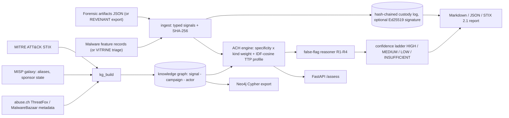

# Architecture

## Scoring

For each actor, support is a noisy-OR over (a) the case's point signals that link to it, each weighted
`kind weight x specificity` where specificity = 1 / number of actors the signal links to, and (b) one
tradecraft term `0.6 x IDF-cosine(case techniques, actor technique profile)`. Contradiction is the
noisy-OR of signals that link to other actors; `score = support x (1 - 0.6 x contradiction)`. Every
weight is printed in the report (a Weights table that marks overridden values) and can be overridden
(`--weight imphash=0.2`).
See [ADR 0002](adr/0002-specificity-and-ttp-similarity.md).

## False-flag rules ([ADR 0003](adr/0003-false-flag-rules.md))

| Rule | Fires when |
|---|---|
| R1 | an actor is supported only by discriminating forgeable artifacts (Rich header, language, mutex) |
| R2 | forgeable artifacts and hard evidence point to disjoint actors (the Olympic Destroyer pattern) |
| R3 | specific hard evidence points to actors of *different* sponsor states |
| R4 | anchored tooling/infrastructure points to one actor while tradecraft matches another state's actor |

## Confidence ladder

HIGH needs two independent anchor kinds, score >= 0.85, margin >= 0.3 and no flags; MEDIUM needs an
anchor, score >= 0.6, margin >= 0.2 and no flags. Tradecraft-only evidence reaches at most LOW. Any
false-flag indicator caps the verdict at LOW; if `FALSE_FLAG` leads, no actor is named.

## Modules

| Module | Role |
|---|---|
| `dragnet/sources/` | loaders: ATT&CK STIX, MISP galaxy, APTnotes, abuse.ch (metadata) |
| `dragnet/kg_build.py` | knowledge graph (profiles, campaigns, aliases, sponsor state, IOC and imphash layers) |
| `dragnet/graph.py` | signal index, specificity, IDF-cosine TTP similarity |
| `dragnet/ach.py` | ACH scoring, false-flag rules, confidence ladder, ACH matrix |
| `dragnet/ingest.py`, `custody.py` | evidence to signals, content hashing, custody chain, Ed25519 signing |
| `dragnet/adapters.py` | REVENANT / VITRINE export to case file |
| `dragnet/stix.py` | STIX 2.1 bundle export |
| `dragnet/bench.py` | baselines, ablations, metrics, bootstrap CIs, false-flag stress test |
| `dragnet/report.py`, `cli.py`, `api.py`, `neo4j_export.py` | reports, CLI, FastAPI, Neo4j Cypher |
