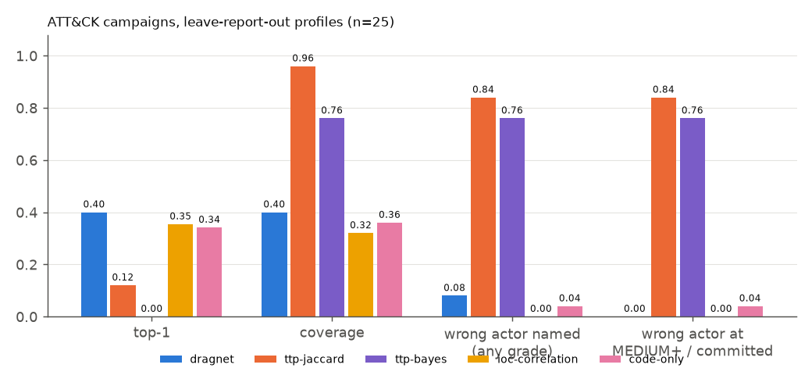
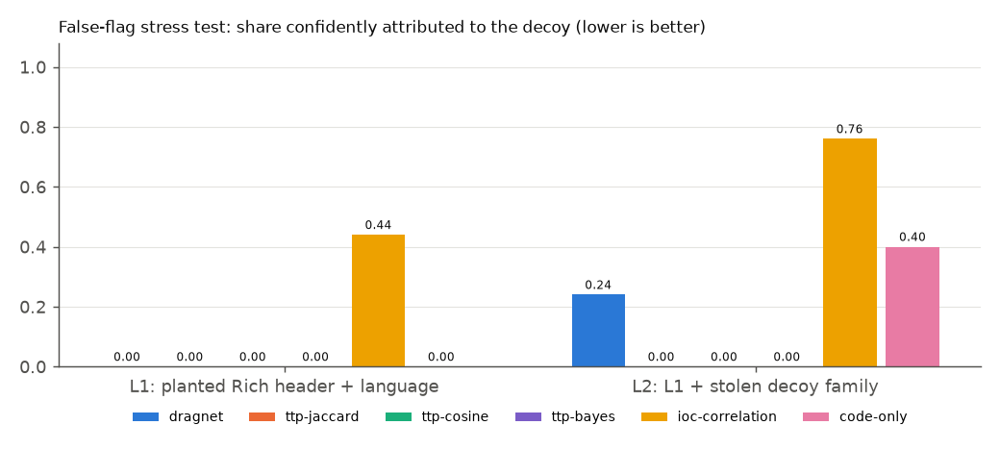
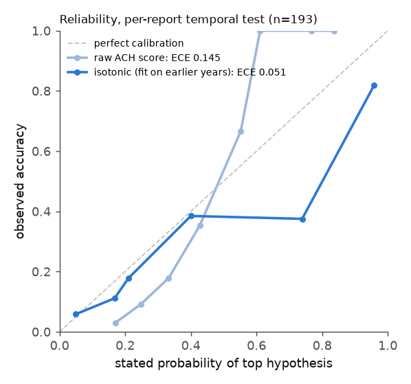
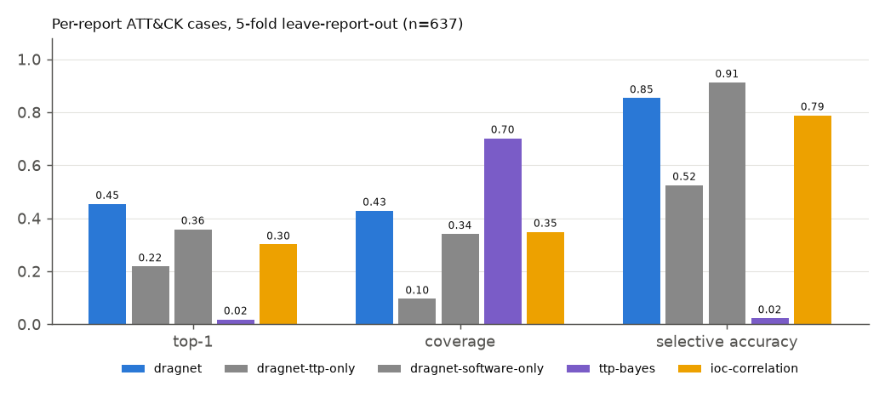

# Evaluation

All numbers come from `python scripts/run_benchmarks.py`, run by the `bench` GitHub Actions
workflow on the dataset snapshot in `data/MANIFEST.json` ([Reproduce](reproduce.md)). Protocol details:
[ADR 0004](adr/0004-evaluation-protocol.md).

## Protocol in brief

- **Leave-report-out.** Before a case is attributed, every group edge whose citations are a subset
  of the case's own citations is removed (A1-LF, R, G). Plain A1 is kept only as a leaky upper bound.
- **Per-report cases (R).** One case per (group, cited report) with at least 3 techniques: 637 cases
  over 161 groups; 5-fold by report, and a temporal split (profiles from pre-2022 reports, 193 later cases).
- **Commitment rule.** Baselines commit only on a unique top score (ties abstain); DRAGNET commits at
  MEDIUM+, and its LOW verdicts are counted separately as "wrong actor named (any grade)".
- **Uncertainty.** Exact Clopper-Pearson intervals for proportions, case or group/family-cluster
  bootstrap for top-1, exact sign-flip tests with Holm correction for paired differences.
- **Genetics (E2/E3, B3).** Time split at 2024-01-01; collision filters and the TLSH radius use
  pre-cutoff or validation data only; results per family and with WannaCry excluded.
- **Published comparison (G).** Guru, Moss & Kochenderfer (2025) adapted to ATT&CK human-curated
  per-report technique lists; an adaptation, not a reproduction.

## What the results say

1. On leakage-controlled per-report cases DRAGNET beats every single-signal and TTP baseline on top-1
   (0.454 vs at most 0.310, Holm p < 0.001) with lower selective risk at equal coverage.
2. On the 25 campaigns, with leakage removed, the edge over IOC correlation (+0.05) is not significant.
3. Tradecraft-only LOW verdicts are unreliable (A3 0/10); MEDIUM verdicts are reliable (R: 79/83).
4. The false-flag rules matter only when a hard decoy anchor is planted (level 2: -0.23).
5. Imphash and TLSH genetics are precise but rare anchors, and mostly re-identify commodity families.

*Figure 1. Top-1, coverage and wrong commitments per method on the campaign set.*

*Figure 2. Confident decoy attributions at decoy levels 1 and 2.*

*Figure 3. Reliability of DRAGNET's top-hypothesis score.*

*Figure 4. Same-engine signal-family ablation on per-report cases.*

## Full generated results

--8<-- "results/RESULTS.md:3:"
