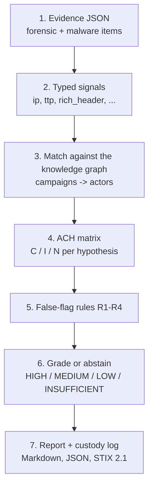
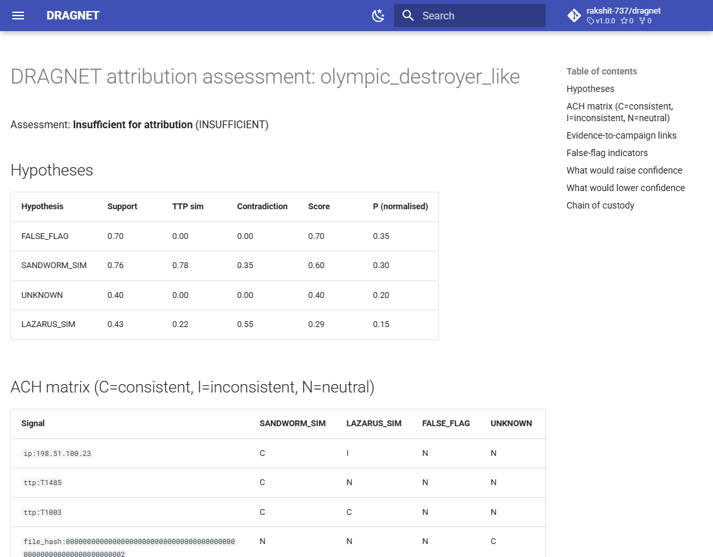

# How it works

This page follows one synthetic case, `dragnet/data/cases/olympic_destroyer_like.json`, through the
pipeline. Run it yourself (no downloads, stdlib only):

```bash
python -m dragnet assess dragnet/data/cases/olympic_destroyer_like.json
```



## 1. Evidence

Two items: a host record (a connection to `198.51.100.23`, techniques T1485 and T1003) and a
malware record (a Rich header `rh:9f8e7d6c`, an unknown wiper family). Each item is hashed into a
hash-chained custody log the moment it is ingested.

## 2. Typed signals

Every value becomes a typed signal. Kinds have different forgeability: an IP or code-reuse match is
*hard* evidence; a Rich header, language string or mutex is *forgeable* and can never attribute on
its own.

## 3. Knowledge-graph matches

The IP belongs to a Sandworm-like campaign; the Rich header matches a Lazarus-like sample. Each
match is weighted by **specificity** (how many actors share that value), so commodity tooling counts
for little.

## 4. ACH matrix

| Signal | SANDWORM_SIM | LAZARUS_SIM | FALSE_FLAG | UNKNOWN |
|---|---|---|---|---|
| `ip:198.51.100.23` | C | I | N | N |
| `ttp:T1485` | C | N | N | N |
| `ttp:T1003` | C | C | N | N |
| `family:UnknownWiper` | N | N | N | C |
| `rich_header:rh:9f8e7d6c` | I | C | C | N |

`FALSE_FLAG` and `UNKNOWN` are always hypotheses. Support is a capped noisy-OR over independent
evidence items; contradictions subtract.

## 5. False-flag rules

- **R1** an actor supported only by forgeable signals is flagged;
- **R2** forgeable artefacts point to one actor while hard evidence points to another (fires here);
- **R3/R4** cross-state and tradecraft-mismatch checks ([ADR 0003](adr/0003-false-flag-rules.md)).

## 6. Grade

`FALSE_FLAG` (0.70) edges out `SANDWORM_SIM` (0.60), so DRAGNET reports **INSUFFICIENT** rather
than naming either actor, and says what would raise or lower confidence. HIGH needs two
*independent* hard anchors and a clear margin.

## 7. Report



The full report is on the [demo page](demo/olympic_destroyer_like.md). Changing a weight
(`--weight imphash=0.2`) re-runs the same deterministic pipeline, so every verdict is auditable.
