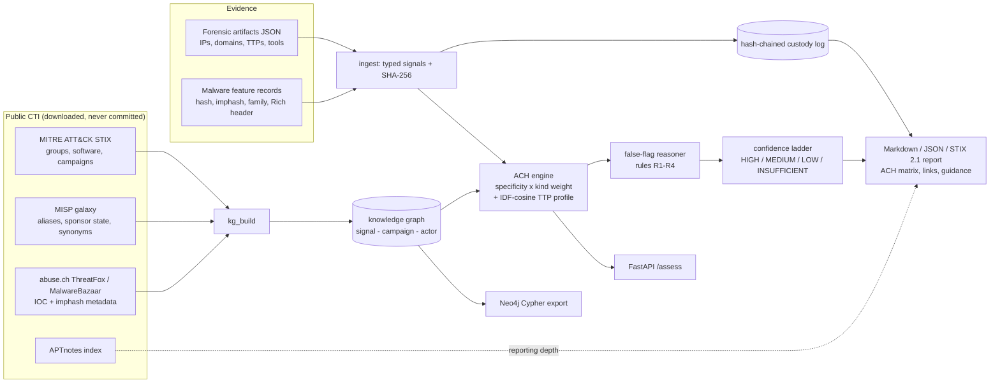

# DRAGNET

[](https://github.com/rakshit-737/dragnet-actor-attribution/actions/workflows/ci.yml)
[](https://github.com/rakshit-737/dragnet-actor-attribution/actions/workflows/bench.yml)

[](https://rakshit-737.github.io/dragnet-actor-attribution/)
[](LICENSE)


**Evidence-to-actor attribution that says "I don't know" when it should.** DRAGNET turns incident
evidence (forensic artifacts and malware feature records) into an auditable Analysis of Competing
Hypotheses (ACH) with mandatory false-flag and unknown hypotheses, a conservative confidence ladder and
a hash-chained, optionally signed custody log, and it is evaluated on real public threat intelligence
(MITRE ATT&CK, MISP galaxy, Malpedia, abuse.ch, APTnotes).

**Contribution in one sentence.** DRAGNET fuses tooling and technique evidence (and, when a case has
them, host IOCs, imphash/TLSH genetics and infrastructure) with specificity weighting into an ACH that
abstains rather than misattributes: on leakage-controlled per-report ATT&CK cases, fusing techniques with
software adds **+0.095** [0.064, 0.130] top-1 over the same engine on software alone and specificity
weighting adds **+0.025** [0.003, 0.048], and its forgeability-aware false-flag rules cut confident decoy
attributions by **0.23** [0.11, 0.37]. The IOC, imphash and TLSH layers are supported inputs whose gain
over plain lookups is *not* shown (sections E2, E3).


### Headline results

Per-report ATT&CK cases (the techniques and software one cited report documents for one group;
n = 637 over 161 groups), leave-report-out profiles. 95% CIs are bootstrapped over threat groups.
Source: bench run [@@RUN_ID@@](@@RUN_URL@@) on commit [`@@RUN_SHA7@@`](@@RUN_COMMIT_URL@@); every table
with every interval is in [`results/RESULTS.md`](results/RESULTS.md).

| method | top-1, 5-fold | top-1, temporal 2022+ (n = 219) | names an actor | right when it names one | wrong actor named |
|---|---|---|---|---|---|
| **DRAGNET** (default engine) | **0.454** [0.401, 0.507] | **0.137** [0.078, 0.214] | 0.429 | 0.853 | 0.063 |
| DRAGNET without the TTP-profile term (ablation) | 0.487 [0.423, 0.541] | 0.126 [0.069, 0.194] | 0.336 | 0.921 | 0.027 |
| malware-family count (`code-only`) | 0.310 [0.251, 0.366] | 0.062 [0.027, 0.107] | 0.323 | 0.913 | 0.028 |
| MISP-style software-overlap count (`ioc-correlation`) | 0.301 [0.245, 0.356] | 0.052 [0.024, 0.090] | 0.349 | 0.788 | 0.074 |
| TTP profile, IDF-cosine (`ttp-cosine`) | 0.218 [0.160, 0.285] | 0.078 [0.034, 0.139] | 0.983 | 0.222 | 0.765 |
| TTP profile, Jaccard (`ttp-jaccard`) | 0.126 [0.084, 0.180] | 0.050 [0.020, 0.091] | 0.936 | 0.133 | 0.812 |

*Coverage, selective accuracy and wrong-actor rate are on the 5-fold set; DRAGNET "names" an actor at
any grade, baselines only on a unique top score. These cases contain only techniques and software
names, so `ioc-correlation` here counts shared malware and tool names and `code-only` shared malware
names.*

- DRAGNET's top-1 lead over every baseline is significant in both protocols with group-clustered
  sign-flip tests (5-fold: Holm p = 5.0e-5 for each, Monte Carlo with B = 200,000; temporal: Holm
  p <= 0.010). Its MEDIUM verdicts are right 79/83 times (0.95 [0.88, 0.99]).
- **The ablation without the TTP-profile term scores higher on 5-fold top-1** (0.487 vs 0.454; paired
  difference -0.034 [-0.067, 0.004], two-sided p = 0.088) and names a wrong actor less often, at lower
  coverage. On the 2022+ temporal split the default is ahead (0.137 vs 0.126, p = 0.62) and in the
  stricter sensitivity split behind (0.078 vs 0.098); none of these differences is significant, so the
  default stays and the trade-off is documented in [ADR 0002](docs/adr/0002-specificity-and-ttp-similarity.md).
- Temporal top-1 is low for every method: profiles built without any report dated 2022 or later
  know little about how groups operate since. LOW verdicts there are right only 18/40 times (0.45
  [0.29, 0.62]).
- On the 25 ATT&CK campaigns with their own reports removed from the profiles (A1-LF), top-1 is 0.40
  [0.20, 0.60] and the edge over IOC correlation (+0.046 [-0.027, 0.147]) is **not** significant (exact
  p = 0.25). With a stolen exclusive decoy family planted, the false-flag rules cut confident decoy
  attributions from 0.40 to 0.17 (10-seed means; effect 0.23 [0.11, 0.37]).

## Try it in 60 seconds

No install needed - the runtime is stdlib-only:

```bash
git clone --depth 1 https://github.com/rakshit-737/dragnet-actor-attribution && cd dragnet
python -m dragnet demo
python -m dragnet assess dragnet/data/cases/olympic_destroyer_like.json
```

`demo` prints one row per synthetic scenario (four cases: a confident multi-signal attribution, a
Rich-header false flag that is withheld with 2 flags, a WannaCry-like code-reuse case, and thin
evidence that abstains). The fifth spec scenario, auditability, is
`python -m dragnet assess dragnet/data/cases/wannacry_like.json --weight imphash=0.2`: the report's
Weights table marks `imphash` as overridden (0.20 instead of 0.60), and the hypothesis scores move
(the leading score drops from 0.99 to 0.98) while the verdict stays LAZARUS_SIM, HIGH, because two
independent anchors remain.

**Docs site:** <https://rakshit-737.github.io/dragnet-actor-attribution/> (architecture, evaluation, CLI/API reference, demo reports).

## Contents

[Headline](#headline-results) · [Try it](#try-it-in-60-seconds) · [How it works](#how-it-works) ·
[Results](#results-on-real-data) · [Case studies](#documented-case-studies) · [Datasets](#datasets) ·
[Quickstart](#quickstart) · [Reproduce](#reproducing-the-numbers) · [Prior art](#prior-art-and-how-dragnet-differs) ·
[Limitations](#limitations) · [Roadmap](#roadmap) · [Safety](#safety-and-ethics)

## How it works



**Scoring.** For each actor, support is a noisy-OR over (a) the case's point signals that link to it,
each weighted `kind weight x specificity` where specificity = 1 / number of actors the signal links to
(an exclusive family counts fully, Mimikatz, linked to 51 groups in ATT&CK v19.2, counts 1/51), and (b) one tradecraft term
`0.6 x IDF-cosine(case techniques, actor technique profile)`. Contradiction is the noisy-OR of signals
that link to other actors; `score = support x (1 - 0.6 x contradiction)`. The Markdown report prints
every weight (overridden ones marked) and the JSON report lists them; override with
`--weight imphash=0.2`. See [ADR 0002](docs/adr/0002-specificity-and-ttp-similarity.md).

**False-flag reasoning is rule-based on purpose** ([ADR 0003](docs/adr/0003-false-flag-rules.md)):

| Rule | Fires when |
|---|---|
| R1 | an actor is supported only by discriminating forgeable artifacts (Rich header, language, mutex) |
| R2 | forgeable artifacts and hard evidence point to disjoint actors (the Olympic Destroyer pattern) |
| R3 | specific hard evidence points to actors of *different* sponsor states (same-state overlap becomes a note) |
| R4 | anchored tooling/infrastructure points to one actor while tradecraft clearly matches another state's actor (the Turla-OilRig pattern) |

**Confidence ladder.** HIGH needs two independent anchor kinds, score >= 0.85, margin >= 0.3 and no
flags; MEDIUM needs an anchor, score >= 0.6, margin >= 0.2 and no flags. Tradecraft-only evidence can
reach at most LOW. Any false-flag indicator caps the verdict at LOW, and if `FALSE_FLAG` leads, no actor
is named.

| Module | Role |
|---|---|
| `dragnet/sources/` | loaders: ATT&CK STIX, MISP galaxy, APTnotes, abuse.ch ThreatFox / MalwareBazaar (metadata) |
| `dragnet/kg_build.py` | builds the knowledge graph (profiles, campaigns, aliases, sponsor state, IOC and imphash layers) |
| `dragnet/graph.py` | signal index, specificity, IDF-cosine TTP similarity |
| `dragnet/ach.py` | ACH scoring, false-flag rules, confidence ladder, ACH matrix |
| `dragnet/ingest.py`, `custody.py` | evidence to signals, content hashing, custody chain, Ed25519 report signatures |
| `dragnet/cases.py` | curated real cases (time-of-incident vs retrospective knowledge) |
| `dragnet/bench.py`, `protocols.py`, `scripts/run_benchmarks.py` | baselines, ablations, leave-report-out protocols, statistics |
| `dragnet/report.py`, `cli.py`, `api.py`, `neo4j_export.py` | reports, CLI, optional FastAPI, Neo4j Cypher export |
| `dragnet/stix.py` | STIX 2.1 bundle export |
| `dragnet/adapters.py` | REVENANT / VITRINE JSON exports to case files |
| `dragnet/tlsh.py`, `casesets.py` | TLSH distance and banded index; enlarged case sets |

## Results on real data

All numbers come from `scripts/run_benchmarks.py` in bench run [@@RUN_ID@@](@@RUN_URL@@) (commit
`@@RUN_SHA7@@`) of the [`bench` workflow](.github/workflows/bench.yml); the full tables are in
[`results/RESULTS.md`](results/RESULTS.md), the raw values in `results/benchmark.json`, the protocol in
[ADR 0004](docs/adr/0004-evaluation-protocol.md), and the per-section discussion on the
[Evaluation page](https://rakshit-737.github.io/dragnet-actor-attribution/benchmarks/).

**Methods.** `dragnet` (full engine); `ttp-jaccard` and `ttp-cosine` (nearest actor by technique
overlap); `ttp-binary-bayes` (a simplified binary-profile form of the P(technique | actor) scoring in
Guru, Moss & Kochenderfer, arXiv:2505.11547 - *not* the paper's count-based scorer, which section G
evaluates); `ioc-correlation` (MISP-style count of shared families/tools/IOCs); `code-only` (shared
family/imphash count, a Malpedia/Intezer-style single-signal matcher). A baseline commits only when one
actor holds the unique top score (a tie abstains); DRAGNET commits at MEDIUM or HIGH, and its LOW
verdicts count as "wrong actor named (any grade)" when wrong.

**Statistics.** Proportions carry exact Clopper-Pearson intervals; top-1 CIs bootstrap the unit that
is not independent (threat groups on the per-report set, cases on the 25 campaigns). Paired top-1
differences use a sign-flip test - exact up to 20 discordant units, otherwise Monte Carlo with
B = 200,000 sign flips and p = (k+1)/(B+1), so the smallest reportable p is 5.0e-6 - clustered by group
on the per-report set and Holm-adjusted across methods.

### R - per-report cases: what drives the result

In the 5-fold protocol each fold's reports are removed from every profile first. In the temporal
protocol every citation dated 2022 or later is removed (the date comes from the citation's reference
description, else from its key) and the 219 cases from 2022+ reports are attributed; a sensitivity run
also removes the 83 undated citations.

- **Fusion.** TTP-only DRAGNET reaches 0.218 top-1 (it ranks exactly like `ttp-cosine`) and
  software-only 0.358; fusing both gives 0.454, **+0.095 [0.064, 0.130] over software-only** (one-sided
  sign-flip p = 5.0e-6, Monte Carlo with B = 200,000, flipping whole groups; Holm 5.0e-5; RESULTS.md,
  R-kfold paired table).
- **Specificity weighting** adds +0.025 [0.003, 0.048] (p = 0.014, Holm 0.041) and more than halves the
  wrong-actor rate (0.063 vs 0.148 without it). The false-flag rules change nothing here (these cases contain no
  forgeable artifacts).
- **TTP-profile term:** see the headline - the ablation without it is higher on 5-fold top-1, not
  significantly, and the temporal results go both ways.
- **Selective risk.** At 20% coverage DRAGNET's error rate is 0.031 vs 0.048 for `code-only`
  (difference -0.016 [-0.065, 0.024], not significant); over the whole risk-coverage curve its AURC is
  lower by 0.106 [0.072, 0.150].


**Calibration.** The raw ACH score is *not* calibrated (temporal ECE 0.157 [0.113, 0.210]). An isotonic
map fitted on 406 pre-2022 cases brings ECE on the 219 later cases to 0.073 [0.055, 0.145]; the
baselines' normalised shares are already at 0.015-0.047, so "calibrated" is not a DRAGNET advantage. Use
the discrete grade, or the isotonic map.


### A1-LF / A1 - the 25 ATT&CK v19.2 campaigns (176 candidate groups)

In 18 of 25 campaigns the true group's v19.2 profile already lists the campaign's own software, and all
14 of DRAGNET's correct named verdicts in plain A1 are among them. A1-LF removes, before each campaign,
every group edge whose citations are a subset of the campaign's own citations.

| method | top-1 A1-LF [95% CI] | coverage | selective acc. | wrong at any grade | top-1 A1 (leaky) |
|---|---|---|---|---|---|
| dragnet | **0.400** [0.20, 0.60] | 0.40 | 0.80 | 0.08 | 0.680 [0.48, 0.84] |
| ioc-correlation | 0.354 [0.18, 0.54] | 0.32 | **1.00** | **0.00** | 0.560 |
| code-only | 0.341 [0.16, 0.52] | 0.36 | 0.89 | 0.04 | 0.540 |
| ttp-jaccard | 0.120 [0.00, 0.28] | 0.96 | 0.13 | 0.84 | 0.120 |
| ttp-cosine | 0.080 [0.00, 0.20] | 0.96 | 0.08 | 0.88 | 0.080 |

At n = 25 DRAGNET's advantage over ioc-correlation (+0.046 [-0.027, 0.147]) and code-only (+0.059) is
**not significant** (exact sign-flip p = 0.25, Holm 1.0). With ties treated as abstentions,
ioc-correlation makes no wrong commitments; DRAGNET's 0/25 wrong at MEDIUM+ bounds its rate below 0.137
(exact 95%), not at zero.


### G - comparison with published work: Guru, Moss & Kochenderfer (2025)

Guru et al. rank 29 actors per threat report with P(technique | actor) estimated from technique counts
in training reports (machine-extracted from 727 reports with text embeddings) and report the mean rank of
the true actor (random = 15). Their protocol trains 10 weight matrices on 70/20/10 per-actor splits,
picks the best on the validation split and reports its test mean rank; the paper does not define its
+/-. Their corpus and extracted counts are not public in reusable form, so this is an **adaptation, not a
reproduction**: same scorer and actors, but ATT&CK's human-curated per-report technique lists (261
reports), and every one of 10 random splits evaluated on its test part (mean +/- SD over splits; CI
pooled over splits, resampling actors).

| setting | mean rank of the true actor (of 29) | 95% CI |
|---|---|---|
| paper: uniform prior | 10.68 +/- 0.53 | - |
| paper: expert prior | 7.75 +/- 0.09 | - |
| paper: HyDE + expert prior (best) | 7.55 +/- 0.21 | - |
| ours: their scorer, uniform prior, human technique lists | @@G_guru-uniform@@ |
| ours: their scorer, report-share prior (expert-prior proxy) | @@G_guru-report-prior@@ |
| ours: DRAGNET, techniques only (= `ttp-cosine` ranking) | @@G_dragnet-ttp-only@@ |
| ours: DRAGNET, software only | @@G_dragnet-software-only@@ |
| **ours: DRAGNET** (techniques + software, same splits) | @@G_dragnet@@ |

@@G_TEXT@@

### D - false-flag stress test (A1 cases with planted decoy artifacts from another sponsor state)

| method | L1: Rich header + language planted | L2: + stolen exclusive decoy family (10-seed mean, range) |
|---|---|---|
| **dragnet** | 0.00 confidently names decoy | **0.17** (0.12-0.24) |
| dragnet without false-flag rules | 0.00 | 0.40 (0.40-0.40) |
| ioc-correlation | 0.48 | 0.77 (0.76-0.80) |
| code-only | 0.00 | 0.40 (0.40-0.40) |

Level 1 does not test the rules: forgeable artifacts cannot reach MEDIUM on their own, so DRAGNET
without the rules (and code-only) also score 0.00, and R1 fires by construction because the planted
Rich header matches exactly one simulated reference. Level 2 isolates the rules: they reduce confident
decoy attributions by 0.23 [0.11, 0.37] (bootstrap clustered by case over all case x seed cells). Only
cross-state decoys are tested. False-alarm cost: indicators fire on 4 of 25 clean campaigns (0.16
[0.045, 0.36]; grade capped at LOW).


### Other sections (details on the Evaluation page)

- **A2 / B - older profiles, rolling origin.** ATT&CK v10.1 has no campaign objects, so A2 measures stale,
  open-world profiles, not a temporal hold-out (17 of 25 campaigns have their group in v10.1: DRAGNET
  0.41 [0.18, 0.65], ioc-correlation 0.41 [0.19, 0.63], code-only 0.36 [0.13, 0.60]). B2
  attributes each campaign against the newest release published before it was added (12.1-18.1):
  @@B2_TEXT@@
- **A3 - a new family from its techniques only (n = 411).** DRAGNET names an actor in 10 cases and
  **all 10 LOW verdicts are wrong** (0/10, 95% CI [0, 0.31]): technique overlap alone does not attribute.
- **E2 - imphash (MalwareBazaar, time split at 2024-01-01).** @@E2_TEXT@@
- **E3 - TLSH (MalwareBazaar metadata).** @@E3_TEXT@@
- **B3 - Malpedia-labelled abuse.ch cases.** @@B3_TEXT@@
- **E1 - ThreatFox.** @@E1_TEXT@@
- **F - reporting depth.** With ATT&CK-only aliases, top-1 is 0.36 for A1 actors with no APTnotes report
  (n = 11), 0.89 for 1-5 reports (n = 9) and 1.00 for more (n = 5); Fisher p = 0.007. An association,
  not a cause: APTnotes is dense for 2010-2018, so "0 reports" partly means "recently named actor".
- **K - APTMalware.** @@K_TEXT@@

## Documented case studies

Seven curated cases in [`dragnet/data/real_cases/`](dragnet/data/real_cases/), each with its ground-truth basis
(indictments, government attributions) and references. In **time-of-incident** mode the family first seen
in the incident (WannaCry, NotPetya, Olympic Destroyer) is hidden from the graph. Rules R2 and R4 were
designed from the Olympic Destroyer and Turla/OilRig patterns, and several cases rely on cited,
hand-written graph additions, so these are **demonstrations of designed behaviour, not validation**.

| case | truth (public attribution) | DRAGNET (time-of-incident) | false-flag indicators | ioc-correlation baseline |
|---|---|---|---|---|
| WannaCry 2017 | Lazarus Group | Lazarus Group, MEDIUM | 0 | Lazarus Group |
| NotPetya 2017 | Sandworm Team | Sandworm Team, MEDIUM | 0 | Sandworm Team |
| **Olympic Destroyer 2018** | Sandworm Team | **withheld (INSUFFICIENT)** | 3 | menuPass (wrong) |
| **Turla via OilRig 2019** | Turla | names OilRig at **LOW** with a flag (Turla ranked 2nd) | 1 | OilRig (wrong) |
| Bangladesh Bank 2016 | Lazarus / APT38 | Lazarus Group, MEDIUM | 0 | Lazarus Group |
| Sony Pictures 2014 | Lazarus Group | Lazarus Group, MEDIUM | 0 | Lazarus Group |
| Commodity tooling only | none | withheld (INSUFFICIENT) | 0 | tie among 26 (abstains) |

For Olympic Destroyer DRAGNET reports that the Lazarus-linked Rich header is the only support for
Lazarus and that forgeable and hard evidence point to different actors; it does **not** recover
Sandworm from tradecraft alone (truth ranked 12th). Run them with `python -m dragnet case-study`
(add `--format md` for full reports).

## Datasets

Metadata only - no sample is ever downloaded. About 640 MB in total (the byte sum of
[`data/MANIFEST.json`](data/MANIFEST.json)); details, licences and citations: [docs/datasets.md](docs/datasets.md).

| Source | Size | Pin | Licence |
|---|---|---|---|
| MITRE ATT&CK Enterprise v19.2 + v10.1 (STIX) | 54 + 31 MB | version + SHA-256 | ATT&CK Terms of Use |
| MITRE ATT&CK Enterprise 12.1-18.1, ICS + Mobile 19.2 | 315 + 10 MB | version + SHA-256 | ATT&CK Terms of Use |
| MISP galaxy threat-actor + malpedia | 1.4 + 3.8 MB | commit `e9e867f` + SHA-256 | CC0/BSD-2 ; CC BY-NC-SA 3.0 |
| Malpedia API families and actors | 5.4 MB | manifest SHA-256 (live API) | CC BY-NC-SA 3.0 |
| APTnotes index | 0.15 MB | commit `8595fbd` + SHA-256 | index metadata |
| abuse.ch ThreatFox full export | 3.9 MB | manifest SHA-256 (daily) | CC0 |
| abuse.ch MalwareBazaar full CSV (metadata, incl. TLSH) | 224 MB | manifest SHA-256 (daily) | CC0 |
| trendmicro/tlsh reference vectors (tests) | 0.25 MB | commit + SHA-256 | Apache-2.0 |
| APTMalware `overview.csv` (hash list only) | 1.0 MB | commit `d71ee9f` + SHA-256 | ODbL 1.0 |

## Quickstart

```bash
git clone https://github.com/rakshit-737/dragnet-actor-attribution && cd dragnet
python -m pip install -e ".[dev,api,sign]"     # runtime is stdlib-only; extras for API and signing
python -m pytest -q                            # ~110 tests; real-data tests skip unless the datasets are downloaded
python -m dragnet demo                         # four synthetic scenarios
python -m dragnet assess dragnet/data/cases/olympic_destroyer_like.json
```

With real data (~640 MB):

```bash
export DRAGNET_DATA="$PWD/data/raw"            # PowerShell: $env:DRAGNET_DATA = "$PWD\data\raw"
python scripts/download_data.py                # or: DRAGNET_DATA=/path python scripts/download_data.py
python -m dragnet build-kg                     # -> $DRAGNET_DATA/kg-attack-19.2.json
python -m dragnet case-study olympic_destroyer_2018 --format md
python -m dragnet assess my_case.json --kg "$DRAGNET_DATA/kg-attack-19.2.json" --format json
python -m dragnet export-cypher --kg "$DRAGNET_DATA/kg-attack-19.2.json" -o dragnet.cypher   # Neo4j
pip install -e ".[api]" && python -m dragnet serve --kg "$DRAGNET_DATA/kg-attack-19.2.json" # POST /assess
```

The bench workflow runs this block on every bench run (with a bundled case in place of `my_case.json`).

Interoperability and custody (runs as-is in a fresh clone; the two exports are bundled fixtures):

```bash
python -m dragnet import incident-7 --revenant fixtures/adapters/revenant_export.json \
    --vitrine fixtures/adapters/vitrine_triage.json -o case.json      # REVENANT / VITRINE -> case file
python -m dragnet assess case.json --format stix -o bundle.json       # STIX 2.1 bundle
pip install -e ".[sign]" && python -m dragnet keygen analyst           # analyst.key / analyst.pub
python -m dragnet assess case.json --sign-key analyst.key -o report.json  # Ed25519 over the report body + custody head
python -m dragnet verify report.json --pub analyst.pub                 # exit 1 if verdict, scores, weights or custody changed
docker run --rm -v "$PWD:/w" ghcr.io/rakshit-737/dragnet-actor-attribution assess /w/case.json
```

A case file is `{"case_id": ..., "evidence": [{"id", "kind": "forensic"|"malware", "content": {...}}]}`;
forensic content accepts `network_connections`, `dns_queries`, `dropped_file_hashes`, `ttps`, `tools`,
`mutexes`, `language_artifacts`, `victimology`; malware content accepts `sha256`, `imphash`, `code_reuse`,
`family`, `ttps`, `rich_header`, `language_artifacts`, `c2`, `c2_ips`, `mutexes`, `tools`.

## Reproducing the numbers

See [docs/reproduce.md](docs/reproduce.md) for every command, its runtime and the expected values.
In short:

```bash
python scripts/download_data.py                              # SHA-256 checked for pinned sources
PYTHONHASHSEED=0 python scripts/run_benchmarks.py --only A1LF,A1,G   # light sections, a few minutes
```

The full run (all sections, @@RUNTIME@@ s wall clock on a GitHub-hosted `ubuntu-24.04` runner, single-threaded, peak RSS @@RSS@@) is the
[`bench` workflow](https://github.com/rakshit-737/dragnet-actor-attribution/actions/workflows/bench.yml). It runs the
real-data tests and the quickstart above, then `scripts/compare_results.py` checks every value of the
deterministic sections (A1, A1-LF, A2, A3, R, G, B1/B2, C, D, F) against the committed
`results/benchmark.json` and fails the run on any difference. abuse.ch exports and the Malpedia API
change daily, so B3, E1, E2, E3 and K drift; they are reported, not compared.

## Prior art and how DRAGNET differs

| Existing | What it does | DRAGNET |
|---|---|---|
| MISP correlation | IOC-to-IOC matching | ingests forensic + malware evidence and reasons over competing hypotheses; measured as the `ioc-correlation` baseline |
| Malpedia / Intezer code genetics | single-signal code-similarity attribution | code/imphash is one specificity-weighted anchor among several; `code-only` baseline |
| TTP-similarity attribution (e.g. ATT&CK-profile nearest neighbour; Guru et al. 2025) | ranks actors by technique overlap | IDF-cosine profile term is one input; A3 shows why it cannot stand alone; section G compares with Guru et al. |
| OCCAM (sibling project) | report/TTP-level ACH over ATT&CK incidents with learned grades | artifact-level evidence (IOCs, imphash/TLSH genetics, infrastructure) with forgeability-aware false-flag rules |
| Manual analyst ACH | structured but hand-built, not reproducible | deterministic, weight-transparent, custody-hashed, re-runnable, with mandatory false-flag hypothesis |

## Limitations

- **Small curated n.** 25 attributed ATT&CK campaigns (26 across all releases and domains) and 7
  curated cases; per-report cases (n = 637) are the larger set, but they are slices of the same reports
  ATT&CK profiles are built from (handled by leave-report-out, not eliminated).
- **Ground truth is itself attribution.** ATT&CK, Malpedia and government statements can be wrong;
  Malpedia and ATT&CK agree on @@LABEL_AGREE@@ families both attribute.
- **Leakage.** Plain A1 is a leaky upper bound (0.68); A1-LF (0.40) and R are the controlled numbers.
  An earlier temporal split dated citations by their key only and kept 52 post-2021 reports in the
  "pre-2022" profiles; with description dates the temporal top-1 fell from 0.207 to 0.137.
- **The headline engine is not the best ablation on the 5-fold per-report set** (no-ttpsim 0.487 vs
  0.454, not significant with group clustering); see the headline.
- **Artifact-level fusion is not shown to beat plain lookups.** On imphash and TLSH metadata DRAGNET's
  accuracy is similar to a lookup with the same filter (E2, E3); the per-report gain comes from fusing
  software with techniques.
- **Genetics results are dominated by commodity families** (AgentTesla, WannaCry); family-macro and
  WannaCry-excluded numbers are reported next to per-sample ones.
- **Tradecraft-only LOW verdicts are unreliable** (A3: 0/10; R-temporal LOW 18/40).
- **Raw scores are not calibrated**; use the grade or the isotonic map (temporal ECE 0.073 [0.055, 0.145]).
- **Curated tokens.** Where public evidence is a relationship (a copied Rich header), curated cases use
  descriptive tokens with cited sources rather than raw artifacts.
- REVENANT / VITRINE integration is file-based; there is no live coupling.
- A signature proves that the report body and custody chain are unchanged since signing and, with a
  pinned public key, who signed; key management and trusted timestamps are out of scope, and STIX
  bundles are not signed.

## Roadmap

- [x] Real knowledge graph from ATT&CK + MISP + abuse.ch with provenance
- [x] Leave-report-out evaluation, per-report case set (n = 637), rolling-origin release split
- [x] TLSH fuzzy genetics with a banded index and a time-split benchmark
- [x] Comparison with Guru et al. (2025) under an adapted protocol
- [x] Isotonic calibration evaluated on a temporal split
- [x] Signed reports, STIX 2.1 export, REVENANT / VITRINE adapters, Neo4j export, FastAPI
- [ ] Victimology signals from MISP (sector, country) in the signal-family ablation
- [ ] OCCAM STIX import

## Safety and ethics

DRAGNET is defensive decision support. It never downloads, stores or executes malware (abuse.ch data is
consumed as metadata only), contains no real victim data, and performs no network activity beyond the
explicit dataset download. Attribution is an analytic judgment with diplomatic, legal and human
consequences: every report says so, DRAGNET prefers "insufficient" to a guess, and its output must not
be the sole basis for public naming, sanctions or any "hack-back". See [THREAT_MODEL.md](THREAT_MODEL.md)
and [SECURITY.md](SECURITY.md).

## License

MIT - see [LICENSE](LICENSE). Dataset licences are listed in [docs/datasets.md](docs/datasets.md).
